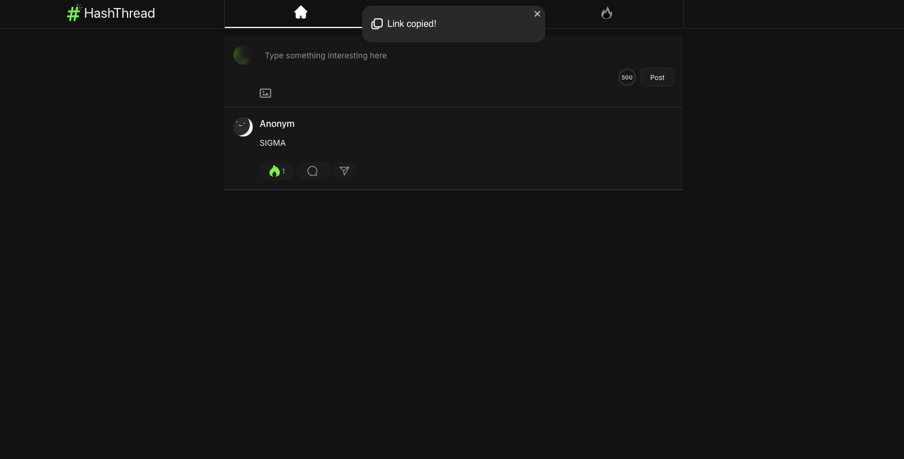

---

# **About**

**HashThread** — анонимная платформа для обсуждений в формате тредов, где каждый тред живёт 24 часа.
Вдохновлено анонимностью *4chan* и удобством *Threads* от Instagram.

---

## 🚀 Demo



---

## **📦 Tech Stack**

### 🖥 **Frontend**

* **Framework:** [Next.js](https://nextjs.org/) — рендеринг на стороне сервера (SSR) и статическая генерация.
* **State Management:** [Zustand](https://zustand-demo.pmnd.rs/) — лёгкое и минималистичное управление состоянием.
* **Data Fetching:** [TanStack Query](https://tanstack.com/query/latest) — управление серверным состоянием и
  кешированием запросов.
* **UI Library:** [shadcn/ui](https://ui.shadcn.com/) — готовые стилизованные компоненты на базе Radix UI.
* **Стили:** [Tailwind CSS](https://tailwindcss.com/) — современная утилитарная CSS-система.

### ⚙️ Backend

* **Framework:** [NestJS](https://nestjs.com/) — модульная архитектура и строгая типизация.
* **Database:** [MongoDB](https://www.mongodb.com/) — документоориентированная база данных.
* **ODM:** [Mongoose](https://mongoosejs.com/) — работа с MongoDB через схемы и модели.

---

## **Как запустить**

### 1) Frontend

```bash
cd hashthread_frontend
npm i
npm run dev
```

По умолчанию поднимется на: **[http://localhost:3000](http://localhost:3000)**

### 2) Backend

```bash
cd hashthread_backend
npm i
nest start dev
```

Swagger-документация API: **[http://localhost:3001/api](http://localhost:3001/api)**

---

## 🔗 Таблица  портов

| Service       | Port  |
|---------------|-------|
| NestJS API    | 3001  |
| MinIO S3      | 9000  |
| MinIO Console | 9001  |
| MongoDB       | 27017 |
| Next Js       | 3000  |


